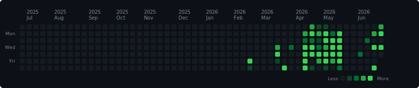

  <!-- 백준 티어 위젯 -->
  
  <!-- 깃허브 통계(티어) 위젯 -->
  

 

## 🛠 Development Tools

### Language

### IDE

### Framework

### Database

### DevOps

### Cloud & OS

### Web Server

### Tools

 

## 📈 BackJoon Code Streak

